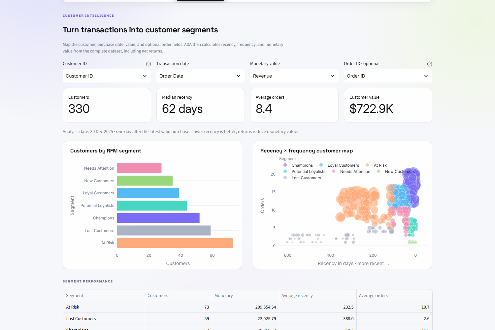
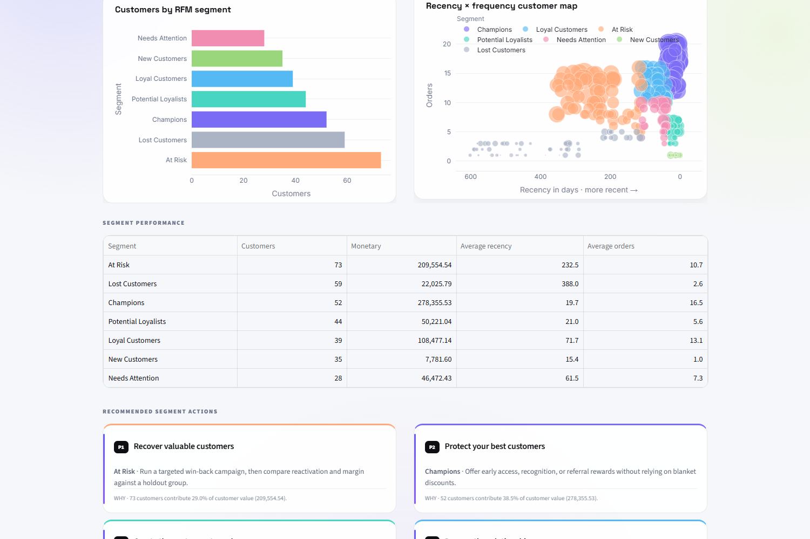
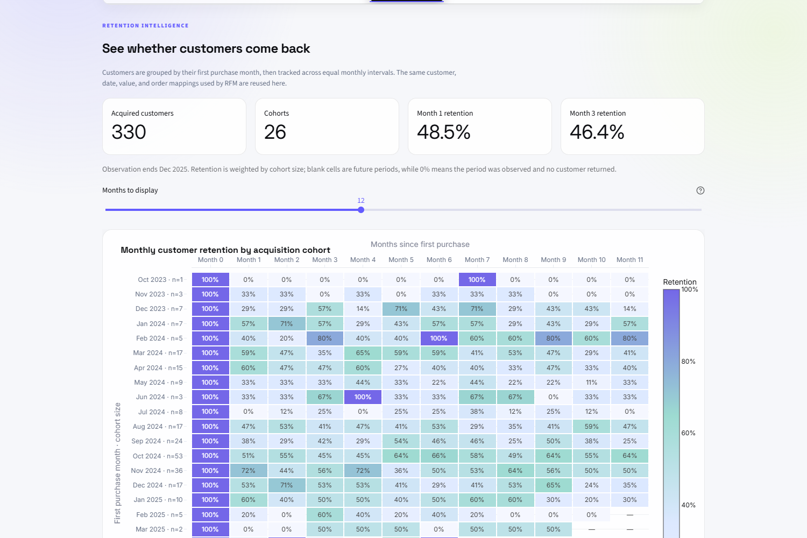
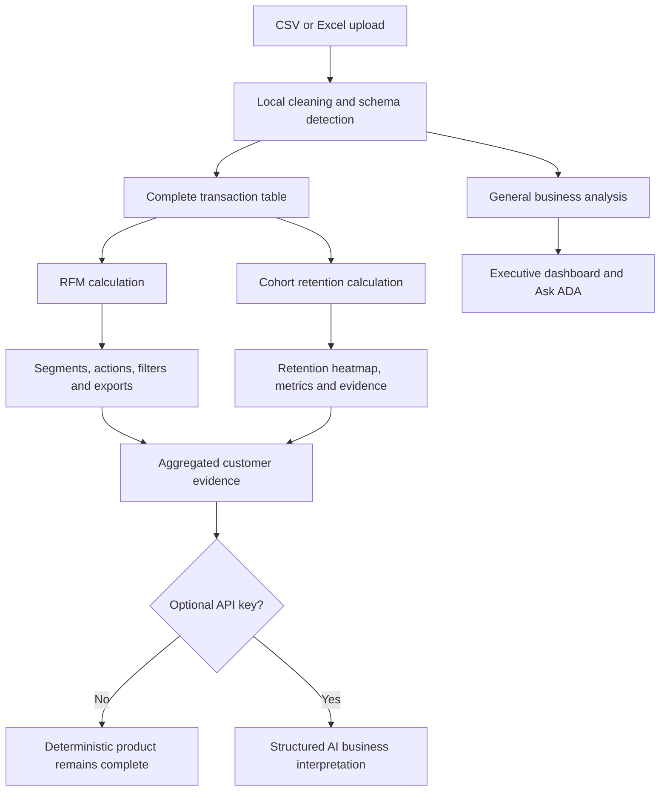

# ADA Customer Intelligence

[](https://www.python.org/)
[](https://streamlit.io/)
[](https://github.com/yukii1111/automated-data-analyst/actions/workflows/ci.yml)
[](LICENSE)

**A portfolio extension of the open-source [Automated Data Analyst](https://github.com/saineshnakra/automated-data-analyst), adding transaction-aware RFM segmentation, cohort retention analysis, and privacy-conscious AI customer insights.**

[Live demo](https://ada-customer-intelligence.streamlit.app/) ·
[Repository](https://github.com/yukii1111/automated-data-analyst) ·
[Original project](https://github.com/saineshnakra/automated-data-analyst) ·
[Architecture](docs/architecture.md) ·
[Privacy](docs/privacy.md)

> **Project status:** portfolio release on `main`. The deterministic analytics workflow is complete and the optional AI layer is isolated so the application remains useful without an API key.



## 中文项目介绍

这是一个面向电商、用户增长和运营分析场景的自动化客户洞察工具。用户可以上传 CSV 或 Excel 交易数据，系统会在本地完成字段识别、数据清洗和指标计算，并生成 RFM 客户分层、月度 Cohort 留存热力图、可执行运营建议及可下载结果。项目在开源 Automated Data Analyst 的基础上新增了完整的客户智能分析链路，并通过退货冲销、重复订单行、缺失 ID、小样本 Cohort 等边界测试保证计算可靠性。

可选的 AI 模块只接收已经聚合的客户指标，不上传原始交易行、客户 ID 或订单 ID；没有 OpenAI API Key 时，全部确定性分析、图表和导出功能仍可正常使用。这个项目重点展示了我将数据分析方法转化为可交互产品的能力，包括业务需求拆解、Python 数据处理、Streamlit 产品实现、隐私设计和自动化测试。

## Why this extension exists

The original ADA project already turns an uploaded CSV or Excel workbook into a traceable business dashboard. This extension addresses a common ecommerce and growth analytics gap: a general revenue dashboard can explain *what changed*, but it does not automatically explain *which customers are valuable, which are lapsing, or whether newly acquired customers return*.

The added customer intelligence workflow answers three practical questions:

1. **Who should the business retain, reward, or reactivate?** — RFM segmentation.
2. **Do acquired customers return in later months?** — cohort retention analysis.
3. **What actions are supported by the calculated evidence?** — deterministic recommendations plus an optional AI interpretation layer.

The result is designed for customer analytics, ecommerce operations, growth analysis, and AI-assisted decision support—not just chart generation.

## Portfolio contribution

This repository is an open-source extension, not a claim that the entire base application was built from scratch. The table below separates the inherited product foundation from the work added in this portfolio project.

| Area | Open-source foundation | Portfolio extension |
|---|---|---|
| General analysis | Automatic schema detection, KPIs, trends, anomalies, forecasts, evidence cards | Customer-specific analysis reuses the prepared full transaction table without corrupting lifetime metrics through dashboard drill-downs |
| Customer segmentation | No customer lifecycle module | Returns-aware RFM engine, percentile scoring, seven actionable segments, quality audit, filter, and safe CSV export |
| Retention | No acquisition cohort analysis | Monthly cohort matrix, weighted Month 1/3 metrics, cohort-size reliability rules, heatmap, evidence cards, and export |
| Business actions | General deterministic recommendations | Segment-specific customer actions and retention signals tied to visible calculations |
| AI interpretation | Optional general strategic narrative and query planner | RFM and cohort summaries added to a separate customer-insight prompt without sending raw rows or customer/order IDs |
| Reliability | Existing automated test suite | Edge-case fixtures for returns, duplicate order lines, missing IDs, future cohort periods, small cohorts, AI privacy, caching, and failure isolation |
| Demo data | SaaS, support, and ecommerce samples | A synthetic 2,899-row customer-orders dataset with 330 customers and realistic lifecycle behaviour |
| UX | Existing Streamlit design system | Dedicated Customer segments and Retention cohorts workspaces with a softer, consistent visualization palette |

## Key features

### 1. Transaction-aware RFM segmentation

The RFM module converts order-level data into one customer-level record:

- **Recency** — days since the most recent positive purchase.
- **Frequency** — number of positive net orders, not number of line items.
- **Monetary** — total customer value after returns are included.
- **R/F/M scores** — robust percentile scores from 1 to 5, including small or tied datasets.
- **Segments** — Champions, Loyal Customers, Potential Loyalists, New Customers, At Risk, Needs Attention, and Lost Customers.

Important data-quality decisions are explicit. Multiple lines with the same order ID count as one order; returns reduce monetary value; zero- or negative-net orders do not count as purchases; and missing order IDs fall back to separate row-level transactions instead of being incorrectly collapsed.



### 2. Cohort retention analysis

Customers are grouped by their first valid purchase month and followed over equal monthly intervals.

The retention workspace includes:

- a cohort-by-month retention matrix;
- weighted Month 1 and Month 3 retention metrics;
- cohort sizes displayed beside each acquisition month;
- a distinction between observed `0%` retention and future, not-yet-observable periods;
- a minimum cohort-size rule for comparative insight cards;
- deterministic insights for acquisition volume, baseline retention, the latest reliable cohort, and the strongest Month 3 cohort;
- downloadable retention data and a visible quality audit.



### 3. Evidence-grounded AI customer insights

The optional AI layer uses the OpenAI Responses API with Pydantic structured outputs. It interprets calculated summaries; it does not calculate RFM or retention itself.

Only aggregated evidence is included in the customer-insight payload:

- customer counts and total value;
- average order frequency and median recency;
- segment-level metrics and deterministic actions;
- weighted retention rates and computed cohort insights.

Raw uploaded rows, customer IDs, and order IDs are excluded. Results are cached for the current dataset so an ordinary Streamlit rerun does not create another model call. Changing the underlying data invalidates the cached narrative. API failures degrade to a friendly message while the deterministic dashboard remains available.

No API key is required for RFM, cohort analysis, charts, exports, or evidence cards.

## End-to-end workflow



The architectural boundary matters: calculation modules (`rfm.py` and `cohort.py`) do not import Streamlit. They can be tested with dataframes and reused from a notebook, API, or another interface. The UI renders their result objects but does not own the business calculations.

## Try the customer intelligence sample

Choose **Try a sample dataset → Customer Orders** in the app. The synthetic sample contains:

- 2,899 transaction rows;
- 330 customers;
- repeat purchases across 26 acquisition cohorts;
- recent, loyal, lapsing, and low-value behaviour;
- negative return rows for testing net customer value.

It contains no real customer data. The source is available at [`samples/customer-orders.csv`](samples/customer-orders.csv), and its reproducible generator is [`tools/generate_customer_orders.py`](tools/generate_customer_orders.py).

## Run locally

### Windows PowerShell

```powershell
git clone https://github.com/yukii1111/automated-data-analyst.git
cd automated-data-analyst
py -m venv .venv
.\.venv\Scripts\Activate.ps1
python -m pip install -r requirements.txt
streamlit run app.py
```

### macOS or Linux

```bash
git clone https://github.com/yukii1111/automated-data-analyst.git
cd automated-data-analyst
python3 -m venv .venv
source .venv/bin/activate
python -m pip install -r requirements.txt
streamlit run app.py
```

The application opens with a built-in demo. To exercise the new modules, select the **Customer Orders** sample. Upload limits are 25 MB per file and 250,000 analyzed rows; supported formats are `.csv`, `.xlsx`, and `.xlsm`.

### Optional AI configuration

The deterministic application needs no API key. To test the optional AI interpretation, enter a project-specific OpenAI API key in the password field in the sidebar. The field is session-only and is not written to the repository.

Alternatively, a local deployment can provide `OPENAI_API_KEY` through its environment or Streamlit secrets. Never commit a real key to GitHub.

## Testing and quality

The current portfolio branch passes **357 automated tests** using Python's built-in `unittest` framework.

```bash
python -m unittest discover -s tests -p "test_*.py"
```

Static checks use Ruff:

```bash
python -m ruff check .
```

The added tests cover:

- order-line deduplication and net returns;
- invalid dates, monetary values, customer IDs, and order IDs;
- reproducible analysis dates and small/tied RFM samples;
- cohort eligibility, future periods, zero retention, and weighted metrics;
- minimum cohort sizes for comparative claims;
- exclusion of raw identifiers from AI payloads;
- structured AI responses, caching, dataset invalidation, and API failure isolation;
- complete Streamlit rendering with and without the optional AI dependency.

## Technology

| Layer | Tools |
|---|---|
| Application | Python, Streamlit |
| Data processing | pandas, NumPy |
| Visualization | Plotly |
| File support | CSV, Excel, openpyxl |
| AI integration | OpenAI Responses API, Pydantic structured outputs |
| Testing and quality | unittest, Streamlit AppTest, Ruff |

## Project structure

```text
app.py                  Streamlit entry point and workflow orchestration
pipeline.py             File preparation, cleaning, role selection, and focus logic
business_insights.py    General evidence and deterministic recommendations
rfm.py                  Customer-level RFM calculation and segment actions
cohort.py               Monthly cohort retention calculation and insights
ai_insights.py          Optional typed AI narratives and query planning
ui.py                   Streamlit components and Plotly visualizations
samples/                Synthetic datasets for reproducible demonstrations
tests/                  Unit, integration, edge-case, and app smoke tests
tools/                  Reproducible sample generation and portfolio screenshot automation
docs/                   Original project concepts, architecture, privacy, and references
```

## Privacy and trust model

When run locally, cleaning, customer calculations, charts, exports, and rule-based questions stay on the machine.

If the optional AI layer is enabled:

- the general query planner receives schema information and returns a calculation plan for approval;
- customer insights receive computed aggregates and evidence, not uploaded rows;
- model-generated code is never executed;
- `store=False` is used for model responses;
- the calculated dashboard remains authoritative and AI text is labelled as interpretation.

When using any hosted Streamlit deployment, uploaded files necessarily reach that Streamlit server for in-memory processing. Sensitive data should be analyzed locally unless the deployment's controls have been reviewed.

See the inherited [privacy documentation](docs/privacy.md) and [security policy](SECURITY.md) for the base application's broader trust model.

## Current limitations

- RFM and cohort analysis require the user to map a stable customer identifier and transaction date; RFM additionally requires a monetary field.
- Monthly cohort retention measures repeat purchase activity, not subscription survival or causal loyalty.
- Segment thresholds are percentile-based and should be adapted before production use in a specific business.
- Small cohorts are displayed, but comparative insight cards require at least five customers.
- AI text can misinterpret valid calculations and must not be treated as causal proof.
- The hosted demo is intended for synthetic or non-sensitive data; confidential datasets should be analyzed locally.

## Roadmap

- [x] Build and test the RFM calculation engine
- [x] Add customer segment dashboards, actions, filters, and exports
- [x] Build and test monthly cohort retention analysis
- [x] Add evidence-backed retention signals and a cohort heatmap
- [x] Add privacy-aware RFM and cohort summaries to the optional AI layer
- [x] Test AI rendering, caching, invalidation, and failure isolation without paid API calls
- [ ] Validate a small set of AI outputs with a real project API key
- [x] Add portfolio screenshots
- [ ] Record a short walkthrough GIF
- [x] Deploy the customer intelligence release as a public demo
- [x] Merge the completed portfolio release into `main`

## Open-source origin and attribution

This work builds on **ADA: Automated Data Analyst**, created by [Sainesh Nakra](https://github.com/saineshnakra). The original repository, product design, general analytics pipeline, documentation, and inherited assets remain attributable to the original author.

- Original source: [saineshnakra/automated-data-analyst](https://github.com/saineshnakra/automated-data-analyst)
- Original documentation: [docs/](docs/README.md)
- Original contribution guide: [CONTRIBUTING.md](CONTRIBUTING.md)
- Upstream roadmap: [ROADMAP.md](ROADMAP.md)

The repository remains available under the [MIT License](LICENSE). Copyright notices from the original project are retained as required.

## License

[MIT](LICENSE) · Original project copyright © 2024 Sainesh Nakra.
